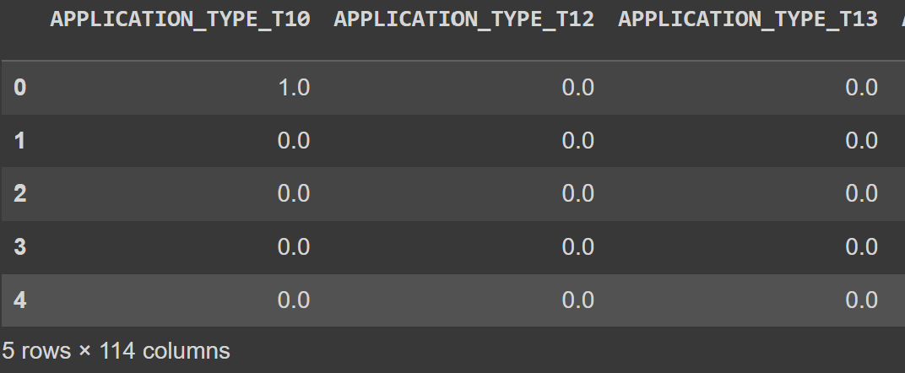

# **Neural Network Machine Learning**

## *Necessary Library Installs*

- import pandas as pd
- from pathlib import Path
- import tensorflow as tf
- from tensorflow.keras.layers import Dense
- from tensorflow.keras.models import Sequential
- from sklearn.model_selection import train_test_split
- from sklearn.preprocessing import StandardScaler,OneHotEncoder

***As the anaylysis was done on Google Colab, you will need the additional below imports:***
- ***from google.colab import drive***
- ***drive.mount('/content/drive')***
- ***from google.colab import files***

-------
## *Analysis*

To begin our analysis for Alphabet Soup venture capital firm, we were provided with data for over 34,000 organizations. In the data we had information such as the type of organization, their status, income, asking amount for funding, and whether the organization is successful. We will be using this data, to build a machine learning model using neural networks to predict a companies success rate if our firm provides funding.

As some of the data provided is not numerical, we would need to encode it. One method of encoding is by using OneHotEncoder. To use the encoder, a seperate dataset is created of the columns that contain non-numerical (object) values, create an encoder instance and run the object values dataset through the instance.
```python
#Create a OneHotEncoder instance
enc = OneHotEncoder(sparse=False)
#Encode the categorcal variables using OneHotEncoder
encoded_data = enc.fit_transform(applicant_data_df[categorical_variables])
# Create a DataFrame with the encoded variables
encoded_df = pd.DataFrame(encoded_data,           columns=enc.get_feature_names(categorical_variables))

```
The encoded data will look like a snapshot of the below DataFrame:




The encoded data is addded to the 'Is_Successful' column and then seperated into the features (X) and the target (y) datasets. These datasets are further split to training and testing datasets.

Also, before using the datasets in the ML model, it must be scaled.

Once this was done 3 different models were build using the data.

The models were as follows:

*Model 1*

number of: input features - 116, output neurons - 1, hidden node layer 1 - 58, hidden node layer 2 - 29

for the activation and hidden layers the RELU function was used, while for the output the linear function

for compiling: optimizer='adam', loss='binary_crossentropy', metrics='accuracy'

*Model 2*

number of: input features - 116, output neurons - 1, hidden node layer 1 - 58, hidden node layer 2 - 29, hidden node layer 3 - 14

for the activation and hidden layers the RELU function was used, while for the output the sigmoid function

for compiling: optimizer='adam', loss='mean_squared_error', metrics='accuracy'

*Model 3*

number of: input features - 116, output neurons - 1, hidden node layer 1 - 29

for activation and hidden layers the RELU function was used, while for the output the sigmoid function

for compiling: optimizer='adam', loss='mean_squared_error', metrics='accuracy'

## **Results**

Model 1 provided loss at 0.5990 and accuracy at 0.7301; Model 2 provided loss at 0.1846 and accuracy at 0.7308; Model 3 provided loss at 0.1851 and accuracy at 0.7305. 

Out of the three models either Model 2 or 3 works best, as the loss was at such low points compared to Model 1 loss.
